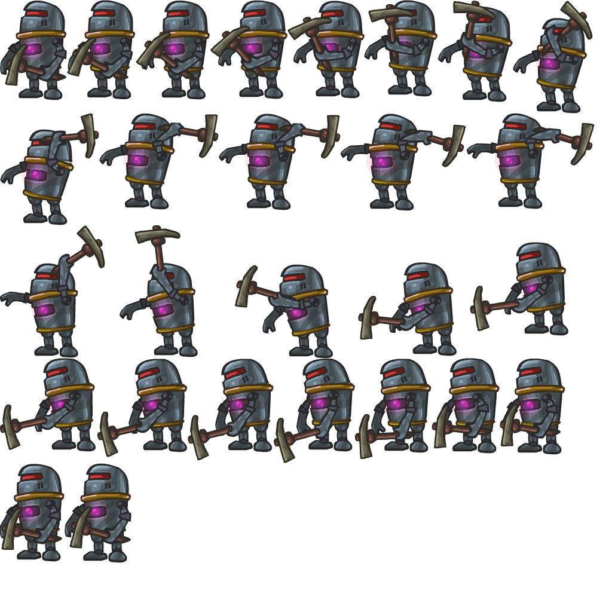
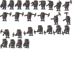
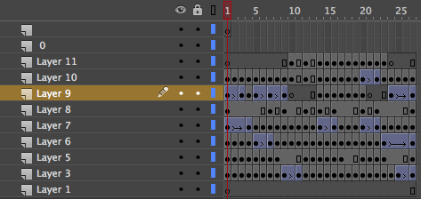

<center>
  <object type="application/x-shockwave-flash" data="/articles/format/actor.swf" width="256" height="256">
    <param name="quality" value="high">
    <param name="wmode" value="transparent">
  </object>
</center>

### All graphic art used in this post is copyrighted by [Ant-Karlov](http://www.ant-karlov.ru/)!

<!--
For years, we've all heard rummors about the imminent demise of Flash.
These rummors are somewhat overblown.
The truth is, Flash is really great at what it does, or at least at what it was meant to do, animated vector graphics.
Authoring tools are powerful, easy to use and file sizes are really small.
-->


The `.SWF` binary [file format](http://wwwimages.adobe.com/www.adobe.com/content/dam/Adobe/en/devnet/swf/pdf/swf-file-format-spec.pdf)
encodes a sequence of nested tags (or commands), roughly divided into two broad categories: definition tags and command tags.

* Definition tags define symbols such as shapes, sounds, fonts or images.
* Command tags manipulate the placement of previously defined symbols on the stage.

Below is the contents of a simple `.SWF` file that defines 3 shape symbols and 4 animation frames:

```
 0: DefineShape 1                      // Define a shape with ID 1.
 1: DefineShape 2                      // Define a shape with ID 2.
 2: DefineShape 3                      // Define a shape with ID 3.
 3: PlaceObject 1, Depth 1, Matrix 0   // Place shape with ID 1 at depth 1 and position matrix 0.
 4: PlaceObject 1, Depth 2, Matrix 1   // Place shape with ID 1 at depth 2 and position matrix 1.
 5: PlaceObject 3, Depth 3, Matrix 2   // Place shape with ID 3 at depth 3 and position matrix 2.
 6: ShowFrame                          // Show frame 1.
 7: PlaceObject Depth 1, Matrix 0      // Move the shape at depth 1 to position matrix 0.
 8: PlaceObject Depth 2, Matrix 3      // Move the shape at depth 2 to position matrix 3.
 9: ShowFrame                          // Show frame 2.
10: ShowFrame                          // Show frame 3.
11: PlaceObject Depth 1, Matrix 5      // Move the shape at depth 1 to position matrix 5.
12: ShowFrame                          // Show frame 4.
```

The Flash player executes these tags in order.
For each frame of the animation, it computes a list of objects that need to be rendered.
Seeking forward is simply a matter of executing all tags between the current and target animation frames, provided that all tags up to the target frame have been downloaded.
In order to seek backwards, the Flash player executes all tags from the beginning of the animation to the target frame.
Things have become significantly more complicated over the years, but when Flash was first released nearly 20 years ago, this was the basic execution model.

#### File Size

The Flash animation above, encoded in the `.SWF` file format is roughly `14KB` in size.
The same animation encoded as a `.PNG` sprite sheet produces a `448KB` file (`32X` larger.)


If we wanted a larger [sprite sheet](actor-retina.png "Sprite Sheet Scaled 2X") (2X), for use on a higher resolution display we'd be looking at '996KB', (`70X` larger.)
A sprite sheet that is the same size as the original `14KB` `.SWF` file, looks something like this like this:

<center>

</center>

<!--
<center>

</center>
-->

...